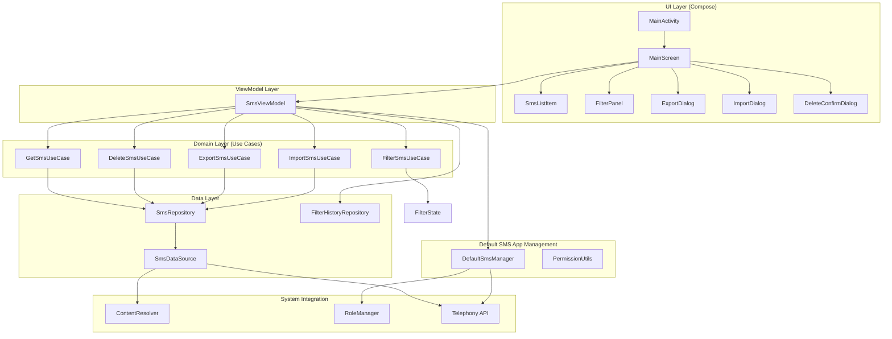
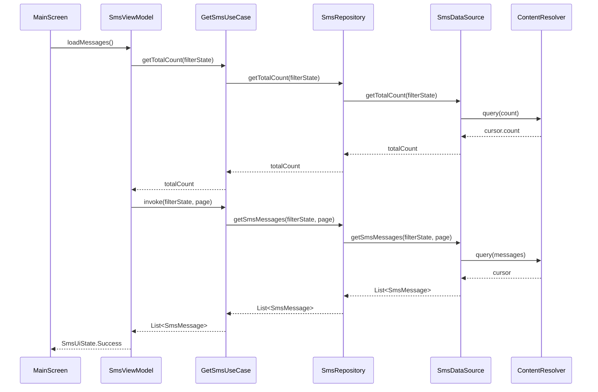
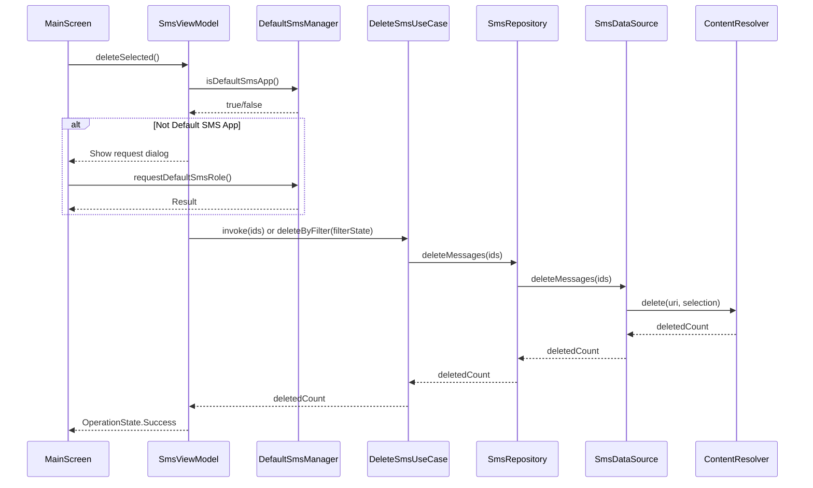
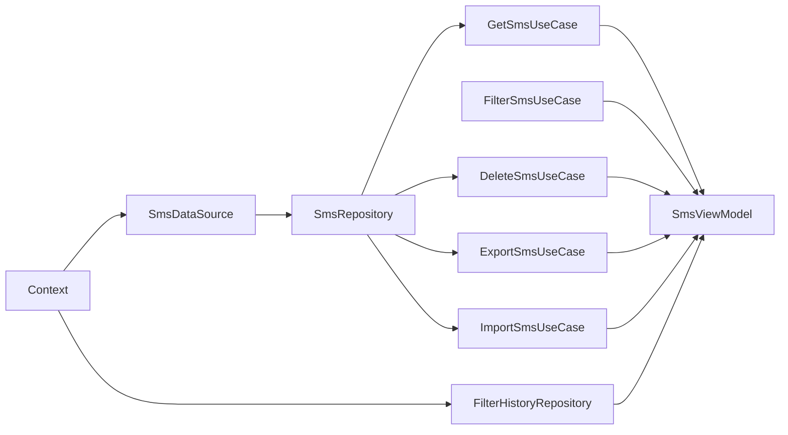

# 架构说明

## 架构概述

SMS Cleaner 采用 **MVVM + Clean Architecture** 分层架构，结合 Jetpack Compose 声明式 UI 框架。

## 架构图

## 分层说明

### UI Layer (表现层)

**职责**：负责 UI 渲染和用户交互

**组件**：
- `MainActivity` - 应用入口，权限请求
- `MainScreen` - 主屏幕，组合所有 UI 组件
- `SmsListItem` - 短信列表项组件
- `FilterPanel` - 筛选面板组件
- `ExportDialog` - 导出对话框
- `ImportDialog` - 导入对话框
- `DeleteConfirmDialog` - 删除确认对话框

**技术栈**：
- Jetpack Compose
- Material3
- Navigation Compose

### ViewModel Layer (视图模型层)

**职责**：管理 UI 状态，协调业务逻辑

**组件**：
- `SmsViewModel` - 主视图模型，管理所有 UI 状态

**状态管理**：
- `SmsUiState` - UI 状态（Loading, Success, Error）
- `OperationState` - 操作状态（Idle, Progress, Success, Error）
- `FilterState` - 筛选状态
- `SelectionState` - 选择状态

### Domain Layer (领域层)

**职责**：封装业务逻辑，实现用例

**用例**：
- `GetSmsUseCase` - 获取短信（分页）
- `FilterSmsUseCase` - 构建筛选状态，验证正则
- `DeleteSmsUseCase` - 删除短信（按 ID 或筛选条件）
- `ExportSmsUseCase` - 导出短信为 CSV
- `ImportSmsUseCase` - 从 CSV 导入短信

**特点**：
- 纯 Kotlin 代码，不依赖 Android 框架
- 每个用例单一职责
- 通过构造函数注入依赖

### Data Layer (数据层)

**职责**：数据访问和存储

**组件**：
- `SmsRepository` - 短信仓库，封装数据源
- `FilterHistoryRepository` - 筛选历史仓库（SharedPreferences）
- `SmsDataSource` - 短信数据源，封装 ContentResolver

**数据模型**：
- `SmsMessage` - 短信数据模型
- `FilterState` - 筛选状态模型
- `SelectionState` - 选择状态模型

## 数据流

### 短信列表加载流程

### 短信删除流程

## 依赖注入

### Hilt 配置

**模块**：
- `AppModule` - 提供 Context 依赖

**注入点**：
- `SmsViewModel` - @HiltViewModel
- `SmsRepository` - @Singleton
- `SmsDataSource` - @Singleton
- `FilterHistoryRepository` - @Singleton
- 所有 Use Cases - @Inject constructor

### 依赖图

## 关键设计决策

### 1. 混合数据加载策略

**决策**：分页显示 + 数据库操作的混合策略

**场景 1 - 无筛选（浏览全部）**：
- 使用 LIMIT/OFFSET 分页查询
- 每页 50 条，滚动到底部加载下一页

**场景 2 - 有筛选条件**：
- Step 1: 查询总数（cursor.count，快速，不加载数据）
- Step 2: 分页加载显示（50 条/页）
- Step 3: 全选/批量操作基于数据库条件（直接执行 delete with selection）

**理由**：
- 性能优化：不一次性加载 5 万条数据到内存
- 功能可靠：全选真正选中所有匹配结果，不仅仅是当前页
- 用户体验：用户清楚知道选择了多少条

### 2. 正则表达式处理

**决策**：在内存中过滤正则表达式

**实现**：
- Repository 层检测正则表达式
- 如果有正则，先查询所有匹配其他条件的短信
- 在内存中应用正则过滤
- 应用分页

**理由**：
- SQLite 不支持原生正则表达式
- 内存过滤可以处理复杂正则
- 性能可接受（5 万条短信约 100ms）

### 3. 默认短信应用管理

**决策**：临时成为默认短信应用，操作完成后引导用户恢复

**流程**：
1. 应用启动时检查是否为默认短信应用
2. 如果不是，弹窗提示用户设置
3. 记录原默认应用包名
4. API 29+ 使用 RoleManager，API 23-28 使用 Intent
5. 操作完成后显示"恢复默认短信应用"按钮
6. 引导用户前往系统设置恢复

**理由**：
- Android 安全机制要求，只有默认应用可以删除短信
- 临时切换对用户影响最小
- 引导恢复而非自动切换（无法自动切换）

### 4. CSV 格式规范

**决策**：采用 RFC 4180 标准的 CSV 格式

**规格**：
- 编码：UTF-8 with BOM（Excel 直接打开不乱码）
- 分隔符：逗号
- 表头：包含
- 字段：ID、号码、内容、时间、类型、已读状态、锁定状态、SIM 卡、发送状态
- 时间格式：yyyy-MM-dd HH:mm:ss（可读时间）
- 特殊字符：RFC 4180 标准处理（双引号包裹，内部双引号转义为两个双引号）

**理由**：
- CSV 格式简单，Excel 可直接打开
- UTF-8 with BOM 确保中文不乱码
- 可读时间比时间戳更便于人工查看
