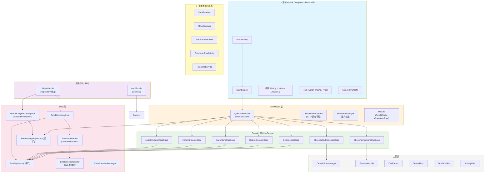
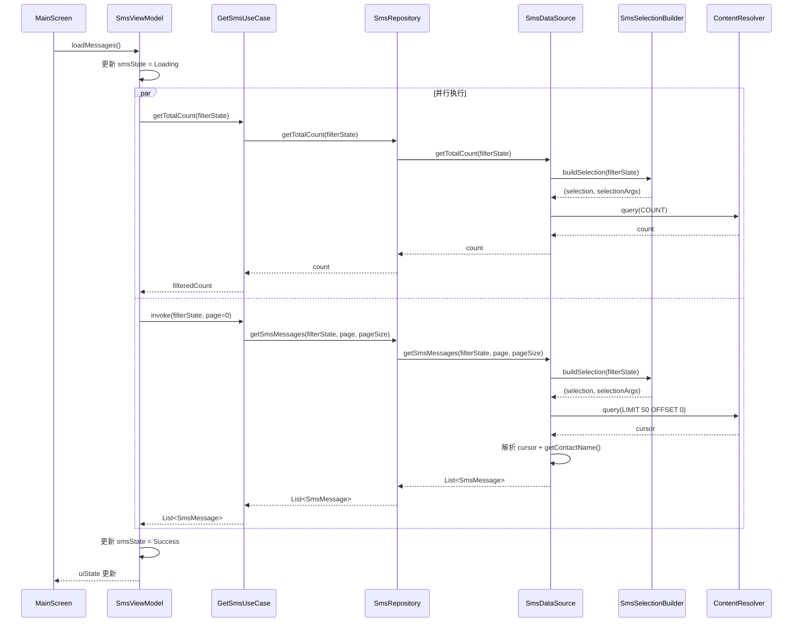
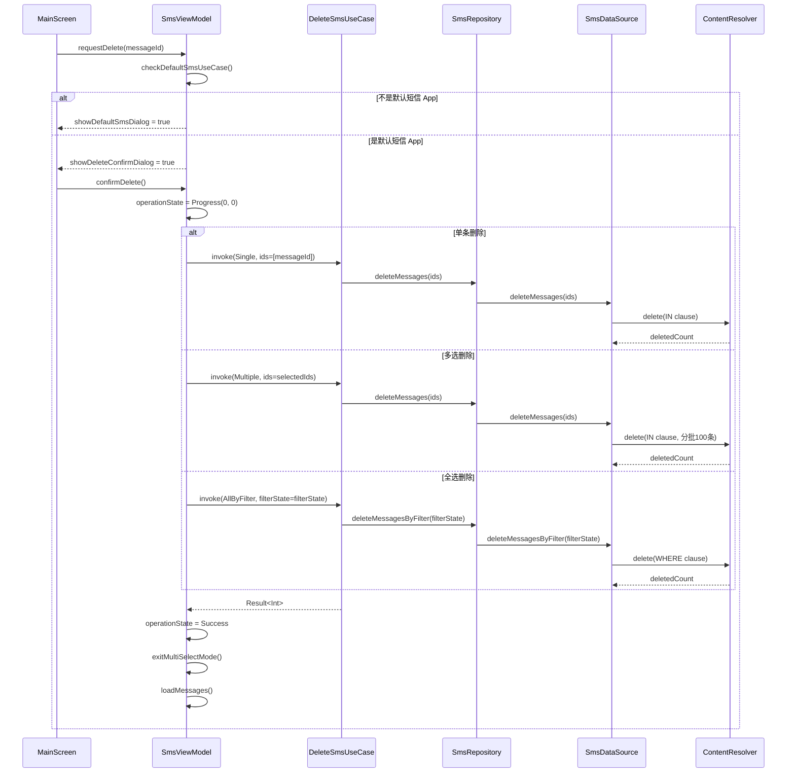
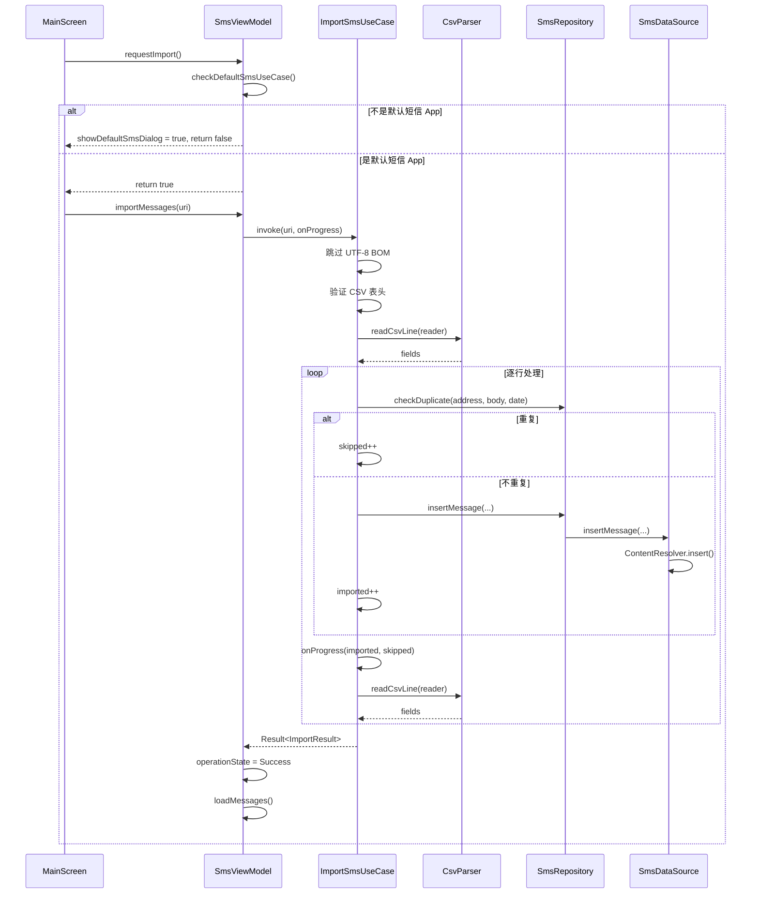
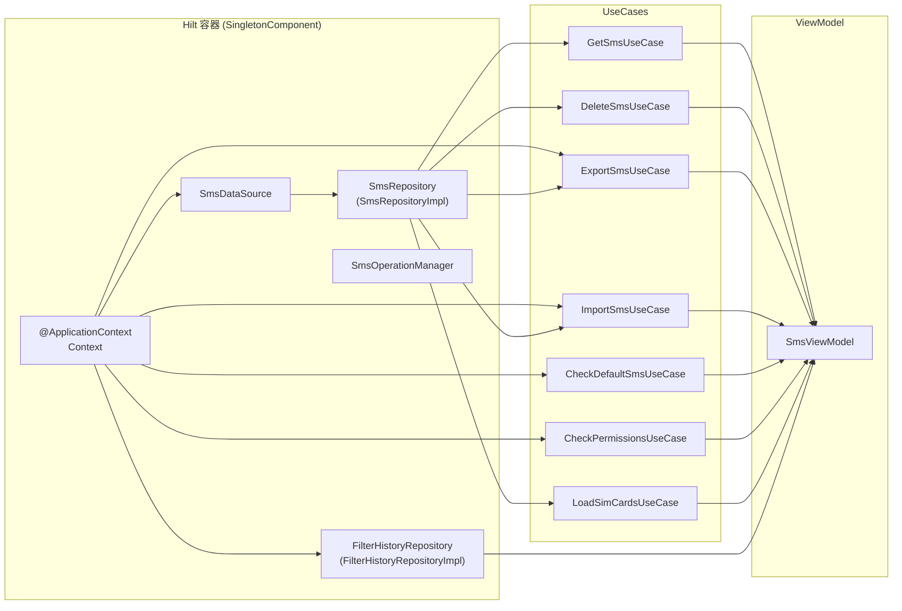

# 架构说明

SMS Cleaner 采用 **MVVM + Clean Architecture** 分层架构，基于 Kotlin + Jetpack Compose + Hilt 构建。

## 整体架构



### 依赖规则

```
UI 层 → ViewModel 层 → Domain 层 → Data 层 (接口)
                                        ↑
                              Data 层 (实现) ──── DI 注入
```

- **UI 层** 只依赖 ViewModel，通过 Hilt 注入
- **ViewModel 层** 依赖 UseCases 和 Repository 接口，不依赖 Android 框架
- **Domain 层** 依赖 Repository 接口，不依赖具体实现
- **Data 层** 实现 Repository 接口，封装 ContentResolver 等系统 API

## 各层详解

### UI 层

路径：`app/src/main/java/top/yuameshi/sms/cleaner/ui/`

UI 层使用 Jetpack Compose + Material3 构建，负责界面渲染和用户交互。

**入口**：`MainActivity.kt` 是应用入口，处理权限请求和 Edge-to-Edge 显示设置。通过 `permissionLauncher` 请求 `READ_SMS`、`READ_CONTACTS`、`READ_PHONE_STATE` 等权限。

**导航**：`NavGraph.kt` 使用 Jetpack Navigation，当前只有单个 `main` 路由指向 `MainScreen`。

**主屏幕**：`MainScreen.kt` 是核心 Composable，包含：

- `ModalNavigationDrawer` + `DrawerFilterPanel` 侧边栏筛选面板
- `Scaffold` + `MainScreenTopBar` 顶部栏（含筛选按钮、导出/导入菜单）
- `LazyColumn` + `SmsListItem` 短信列表（支持下拉刷新、分页加载）
- `MultiSelectBottomBar` 多选操作栏（删除、全选、反选、取消全选、导出）
- `MainScreenDialogs` 对话框集合（删除确认、导出、导入、默认短信 App 设置、操作进度）

**组件**（`ui/component/`）：

| 组件                  | 用途                                   |
| --------------------- | -------------------------------------- |
| `DatePickerDialog`    | 自定义日期范围选择                     |
| `DeleteConfirmDialog` | 删除确认（含预览消息）                 |
| `DrawerFilterPanel`   | 侧边栏多维度筛选面板                   |
| `ExportDialog`        | 导出选项（全部/筛选结果）              |
| `ImportDialog`        | CSV 文件导入                           |
| `SmsListItem`         | 单条短信卡片（支持长按多选、侧滑删除） |

**主题**（`ui/theme/`）：定义 Material3 颜色方案、字体排版和深色模式支持。

### ViewModel 层

路径：`app/src/main/java/top/yuameshi/sms/cleaner/ui/screen/`

**SmsViewModel** 是核心 ViewModel，使用 `@HiltViewModel` 注解，注入 7 个 UseCase + `FilterHistoryRepository`。

关键设计：**SmsViewModel 零 Android 框架依赖**。`Context` 依赖已下沉到 `CheckDefaultSmsUseCase`、`CheckPermissionsUseCase`、`ExportSmsUseCase`、`ImportSmsUseCase` 中。

**状态管理**：`SmsScreenUiState` 是统一的状态数据类，包含 12 个字段：

```kotlin
data class SmsScreenUiState(
    val smsState: SmsUiState,               // 短信列表状态 (Loading/Success/Error)
    val filterState: FilterState,           // 筛选条件
    val selectionState: SelectionState,     // 多选状态
    val operationState: OperationState,     // 操作状态 (Idle/Progress/Success/Error)
    val isDefaultSmsApp: Boolean,           // 是否为默认短信 App
    val hasPermissions: Boolean,            // 是否有权限
    val filterHistory: List<String>,        // 筛选历史
    val simCards: List<SimCardInfo>,        // SIM 卡列表
    val previewMessages: List<SmsMessage>,  // 删除预览消息
    val isRefreshing: Boolean,              // 下拉刷新状态
    val showDeleteConfirmDialog: Boolean,   // 删除确认对话框
    val showDefaultSmsDialog: Boolean       // 默认短信 App 对话框
)
```

这种设计将原来分散的 12 个 `StateFlow` 合并为单一状态流，MainScreen 只需一次 `collectAsStateWithLifecycle()` 调用。

**SmsUiState** 和 **OperationState** 是密封类：

```kotlin
sealed class SmsUiState {
    object Loading : SmsUiState()
    data class Success(
        val messages: List<SmsMessage>,
        val totalCount: Int,
        val filteredCount: Int,
        val hasMore: Boolean,
        val isLoading: Boolean = false
    ) : SmsUiState()
    data class Error(val message: String) : SmsUiState()
}

sealed class OperationState {
    object Idle : OperationState()
    data class Progress(val current: Int, val total: Int) : OperationState()
    data class Success(val message: String) : OperationState()
    data class Error(val message: String) : OperationState()
}
```

**SelectionManager** 是选择状态的内部持有者，ViewModel 通过 `collect` 将其状态镜像到 `SmsScreenUiState.selectionState` 中。这实现了选择逻辑与 ViewModel 的解耦。

### Domain 层

路径：`app/src/main/java/top/yuameshi/sms/cleaner/domain/usecase/`

Domain 层包含 7 个 UseCase，每个 UseCase 封装单一业务逻辑：

| UseCase                   | 职责                              | 依赖                        |
| ------------------------- | --------------------------------- | --------------------------- |
| `GetSmsUseCase`           | 获取短信（分页）+ 查询总数        | `SmsRepository`             |
| `DeleteSmsUseCase`        | 删除短信（单条/多条/按条件）      | `SmsRepository`             |
| `ExportSmsUseCase`        | 导出短信为 CSV 文件               | `SmsRepository` + `Context` |
| `ImportSmsUseCase`        | 从 CSV 文件导入短信               | `SmsRepository` + `Context` |
| `CheckDefaultSmsUseCase`  | 检查是否为默认短信 App            | `Context`                   |
| `CheckPermissionsUseCase` | 检查权限状态                      | `Context`                   |
| `LoadSimCardsUseCase`     | 加载 SIM 卡信息并判断短名称唯一性 | `SmsRepository`             |

**DeleteSmsUseCase** 使用 `DeleteType` 密封类区分删除类型：

```kotlin
sealed class DeleteType {
    data object Single : DeleteType()      // 单条删除
    data object Multiple : DeleteType()    // 多选删除
    data object AllByFilter : DeleteType() // 按筛选条件删除全部
}
```

**LoadSimCardsUseCase** 返回 `SimCardsResult`，包含 SIM 卡列表和 `useShortSimName` 标志。短名称唯一性判断逻辑：如果所有 SIM 卡的短名称都不重复，则使用短名称；否则使用长名称（含蒙版手机号）。

### Data 层

路径：`app/src/main/java/top/yuameshi/sms/cleaner/data/`

Data 层负责数据访问，通过 Repository 接口实现依赖反转。

**SmsRepository**（接口）定义了 7 个方法：

```kotlin
interface SmsRepository {
    suspend fun getSmsMessages(filterState, page, pageSize): List<SmsMessage>
    suspend fun getTotalCount(filterState): Int
    suspend fun deleteMessages(ids: List<Long>): Int
    suspend fun deleteMessagesByFilter(filterState): Int
    suspend fun insertMessage(address, body, date, type, read, subId): Uri?
    suspend fun checkDuplicate(address, body, date): Boolean
    fun getSimCards(): List<SimCardInfo>
}
```

**SmsRepositoryImpl** 是 `SmsRepository` 的实现，直接委托给 `SmsDataSource`。

**SmsDataSource** 封装 `ContentResolver`，是实际与 Android 短信数据库交互的类：

- 查询使用 `Telephony.Sms.CONTENT_URI`
- 删除操作分批处理（每批 100 条），避免 SQL 语句过长
- 维护 `cachedTotalCount` 缓存，无筛选条件时复用计数结果
- `getSimCards()` 通过 `SubscriptionManager` 获取活跃 SIM 卡信息
- `getContactName()` 通过 `ContactsContract.PhoneLookup` 查询联系人姓名

**SmsSelectionBuilder** 是 SQL WHERE 子句构建器，将 `FilterState` 转换为 `Pair<String?, Array<String>?>`。支持的筛选维度：

- 关键词（`BODY LIKE ?`）
- 号码（`ADDRESS LIKE ?`）
- 日期范围（今天/7天/30天/90天/自定义）
- 已读状态
- 锁定状态
- 消息类型（收件箱/已发送/草稿/发件箱）
- SIM 卡（`SUBSCRIPTION_ID`）
- 联系人（`THREAD_ID`）

**SmsOperationManager** 是统一的短信数据库操作管理器，在执行写入操作前检查默认短信 App 状态。

**FilterHistoryRepository**（接口 + 实现）使用 `SharedPreferences` 存储筛选历史，最多保留 5 条记录，使用 `|||` 分隔符。

**数据模型**（`data/model/`）：

| 模型             | 用途                                                                                                      |
| ---------------- | --------------------------------------------------------------------------------------------------------- |
| `SmsMessage`     | 短信数据（id, address, body, date, type, read, locked, subId, contactName）                               |
| `FilterState`    | 筛选条件（keyword, number, dateRange, readStatus, lockStatus, messageType, simSubscriptionId, contactId） |
| `SelectionState` | 多选状态（isMultiSelectMode, selectedIds, isSelectAll, totalFilteredCount）                               |
| `SimCardInfo`    | SIM 卡信息（subscriptionId, displayName, carrierName, phoneNumber, slotIndex）                            |

## 数据流

### 短信加载流程



### 删除流程



### 导入流程



## 依赖注入

使用 Hilt 进行依赖注入，包含两个模块：

### AppModule

```kotlin
@Module
@InstallIn(SingletonComponent::class)
object AppModule {
    @Provides
    @Singleton
    fun provideContext(@ApplicationContext context: Context): Context {
        return context
    }
}
```

提供全局 `Context` 单例，供 `SmsDataSource`、`FilterHistoryRepositoryImpl`、`CheckDefaultSmsUseCase`、`CheckPermissionsUseCase`、`ExportSmsUseCase`、`ImportSmsUseCase` 使用。

### DataModule

```kotlin
@Module
@InstallIn(SingletonComponent::class)
abstract class DataModule {
    @Binds
    abstract fun bindSmsRepository(impl: SmsRepositoryImpl): SmsRepository

    @Binds
    abstract fun bindFilterHistoryRepository(impl: FilterHistoryRepositoryImpl): FilterHistoryRepository
}
```

通过 `@Binds` 将接口绑定到实现，实现依赖反转。

### 注入关系图



## 关键设计决策

### 1. 混合数据加载：分页 + 数据库操作

短信数据通过 `ContentResolver` 查询 Android 系统短信数据库，采用分页加载策略：

- 默认每页 50 条，通过 `LIMIT` + `OFFSET` 实现
- 支持下拉刷新（重新加载第一页）和滚动加载更多
- `totalCount` 缓存：无筛选条件时复用计数结果，避免重复查询
- `filteredCount` 与 `messages` 并行获取，减少等待时间

### 2. 默认短信 App 管理

Android 要求删除/写入短信时，应用必须是默认短信 App。本应用采用"临时角色获取"策略：

- 执行删除/导入前，先检查是否为默认短信 App
- 如果不是，弹出对话框提示用户临时设置
- 操作完成后，用户可通过菜单"恢复默认短信 App"
- 使用 `RoleManager`（Android 10+）或 `Telephony.Sms`（Android 4.4-9）适配不同版本

### 3. CSV 格式规范

导出/导入遵循 RFC 4180 标准：

- **编码**：UTF-8 with BOM（`\xEF\xBB\xBF`）
- **行尾**：CRLF（`\r\n`）
- **字段转义**：包含逗号、双引号、换行的字段用双引号包裹，内部双引号转义为 `""`
- **解析器**：`CsvParser` 支持多行带引号字段的逐字符状态机解析
- **表头**：`ID,号码,内容,时间,类型,已读状态,锁定状态,SIM卡,发送状态`
- **去重**：导入时通过 `address + body + date` 三元组检查重复

### 4. 状态统一管理

将原来分散的 12 个 `StateFlow` 合并为单一 `SmsScreenUiState`：

- 减少 MainScreen 的 `collectAsStateWithLifecycle()` 调用次数（从 12 次降到 1 次）
- 避免多个状态流之间的时序不一致问题
- 使用 `copy()` 实现不可变状态更新

### 5. Repository 接口模式

通过 `SmsRepository` 和 `FilterHistoryRepository` 接口实现依赖反转：

- Domain 层和 ViewModel 层只依赖接口，不依赖具体实现
- 便于单元测试时 Mock 数据源
- Data 层实现接口，封装 `ContentResolver`、`SharedPreferences` 等系统 API

### 6. 选择状态分离

`SelectionManager` 作为独立的状态持有者，管理多选模式的进入/退出、选中/取消选中等逻辑。ViewModel 通过 `collect` 将其状态镜像到统一的 `SmsScreenUiState` 中，实现选择逻辑与业务逻辑的解耦。

## 工具类

路径：`app/src/main/java/top/yuameshi/sms/cleaner/util/`

| 工具类              | 用途                                                  |
| ------------------- | ----------------------------------------------------- |
| `DefaultSmsManager` | 默认短信 App 状态检查和角色请求                       |
| `PermissionUtils`   | 权限检查（`READ_SMS`、`READ_CONTACTS`）和永久拒绝检测 |
| `CsvParser`         | RFC 4180 CSV 逐行解析器（支持多行带引号字段）         |
| `DeviceUtils`       | 小米设备/MIUI/HyperOS 检测（用于 SIM 卡筛选兼容性）   |
| `SmsTextUtils`      | 短信文本工具（首字母提取、日期格式化、关键词高亮）    |
| `ActivityUtils`     | `Context.findActivity()` 扩展函数                     |

## 广播接收器 / 服务

路径：`app/src/main/java/top/yuameshi/sms/cleaner/receiver/` 和 `service/`

这些组件是 Android 默认短信 App 角色要求的必备组件：

| 组件                 | 用途                |
| -------------------- | ------------------- |
| `SmsReceiver`        | SMS 广播接收器      |
| `MmsReceiver`        | MMS 广播接收器      |
| `WapPushReceiver`    | WAP Push 广播接收器 |
| `ComposeSmsActivity` | 短信发送 Activity   |
| `RespondService`     | 短信回复服务        |

当本应用被设置为默认短信 App 时，这些组件负责接收和处理系统广播。

